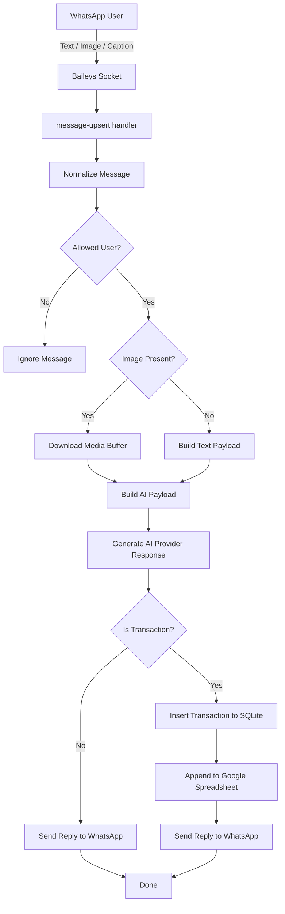

# Renqu Bot

Bot pencatatan keuangan berbasis WhatsApp dengan AI inference multi-provider untuk mengklasifikasikan transaksi pemasukan dan pengeluaran, menyimpan data ke SQLite, dan menyinkronkannya ke Google Spreadsheet.

## Overview

**Renqu Bot** membantu mencatat transaksi keuangan langsung dari percakapan WhatsApp. Pengguna dapat mengirim teks, gambar struk, atau gambar dengan caption, lalu sistem akan memproses input tersebut menggunakan AI untuk mengekstrak transaksi dan menyimpannya sebagai data keuangan terstruktur.

Saat ini aplikasi berjalan sebagai **backend monolith berbasis Bun + TypeScript**. Arsitektur target berikutnya adalah menambahkan **admin GUI berbasis Next.js** untuk setup dan operasional.

Dokumen arsitektur utama tersedia di `docs/specs.md` dan tasklist pengembangan ada di `docs/task.md`.

## Core Capabilities

- Menerima pesan WhatsApp dari user
- Mendukung input teks, gambar, dan gambar + caption
- Mengklasifikasikan transaksi sebagai pemasukan atau pengeluaran
- Menyimpan raw message dan transaksi ke SQLite
- Mengirim balasan otomatis ke WhatsApp
- Menyinkronkan transaksi ke Google Spreadsheet
- Membatasi akses berdasarkan daftar `ALLOWED_USER_IDS`
- Menyimpan sesi autentikasi WhatsApp ke database

## Current Architecture

Komponen utama saat ini:

- **Runtime**: Bun
- **Language**: TypeScript
- **Messaging**: Baileys
- **AI Inference**: saat ini Gemini, diarahkan ke arsitektur multi-provider
- **Database**: SQLite via `Bun.SQL`
- **Spreadsheet Integration**: Google Sheets API

Arah pengembangan berikutnya:

- provider AI yang bisa dipilih: Gemini, OpenAI, Anthropic, dan custom OpenAI-compatible
- admin panel Next.js untuk setup konfigurasi
- health diagnostics dan status WhatsApp via GUI
- abstraction layer untuk AI, config, dan diagnostics service

## Project Structure

```text
renqubot/
├─ docs/
│  ├─ specs.md
│  └─ task.md
├─ scripts/
├─ src/
│  ├─ ai/
│  ├─ events/
│  ├─ spreadsheet/
│  ├─ whatsapp/
│  ├─ config.ts
│  ├─ db.ts
│  └─ index.ts
├─ .env.example
├─ bun.lock
├─ ecosystem.config.cjs
├─ package.json
├─ README.md
└─ tsconfig.json
```

## Application Flow



## Requirements

Sebelum menjalankan aplikasi, siapkan:

- [Bun](https://bun.sh)
- akun WhatsApp untuk login bot
- API key provider AI
- Google Spreadsheet ID
- Google Cloud service account key untuk akses spreadsheet

## Configuration

Salin `.env.example` menjadi `.env` lalu isi nilai yang diperlukan.

### Environment Variables

| Variable           | Required                     | Description                                               |
| ------------------ | ---------------------------- | --------------------------------------------------------- |
| `DATABASE_URL`     | No                           | Lokasi SQLite database. Default: `file:./data/baileys.db` |
| `GEMINI_API_KEY`   | Yes (current implementation) | API key Google Gemini                                     |
| `GEMINI_MODEL`     | No                           | Model Gemini yang digunakan                               |
| `GEMINI_HOST`      | No                           | Base URL Gemini custom                                    |
| `SPREADSHEET_ID`   | No                           | ID file Google Spreadsheet                                |
| `SPREADSHEET_NAME` | No                           | Nama file / konteks spreadsheet                           |
| `SHEET_NAME`       | No                           | Nama tab/sheet di dalam spreadsheet                       |
| `GCLOUD_KEY_PATH`  | No                           | Path ke file service account Google Cloud                 |
| `ALLOWED_USER_IDS` | No                           | Daftar user ID WhatsApp yang diizinkan, dipisahkan koma   |

### Notes

- Implementasi saat ini masih membaca konfigurasi langsung dari environment variable.
- Arsitektur target akan menambahkan config service dan GUI setup.
- `SPREADSHEET_NAME` dan `SHEET_NAME` sengaja dibedakan karena konteksnya berbeda.

## Getting Started

### 1. Install dependencies

```bash
bun install
```

### 2. Setup environment

```bash
cp .env.example .env
```

Lalu isi konfigurasi yang dibutuhkan.

### 3. Run the app

```bash
bun start
```

Atau:

```bash
bun run start
```

### 4. Scan WhatsApp QR

Saat aplikasi berjalan, QR code akan muncul di terminal. Scan menggunakan akun WhatsApp yang ingin dipakai oleh bot.

## Available Commands

```bash
bun start
bun run start
bun run typecheck
bun run bundle
bun run format
```

## Development Notes

- `src/config.ts` saat ini masih memiliki side-effect saat import
- `src/ai/ai.ts` masih terikat pada implementasi provider saat ini dan akan direfactor ke abstraction layer multi-provider
- belum ada HTTP API internal untuk GUI Next.js
- belum ada health endpoint, diagnostics endpoint, atau QR exposure ke UI

## Roadmap Summary

Prioritas pengembangan berikutnya:

1. Refactor configuration platform
2. Bangun abstraction layer AI multi-provider
3. Tambahkan diagnostics dan service API internal
4. Bangun admin GUI dengan Next.js
5. Tambahkan security, observability, dan testing yang lebih lengkap

Detail task tersedia di `docs/task.md`.

## Code Quality

Format kode:

```bash
bun run format
```

Type check:

```bash
bun run typecheck
```

## Security Considerations

- Jangan commit file `.env`
- Jangan commit service account key Google Cloud
- Jangan log secret ke console
- Batasi `ALLOWED_USER_IDS` bila bot tidak boleh diakses publik
- Gunakan kredensial AI dan Google yang terpisah untuk environment development dan production

## Contributing

Untuk perubahan besar, mulai dari `docs/specs.md` agar arsitektur dan arah implementasi tetap konsisten.

Checklist kontribusi yang disarankan:

1. pahami konteks di `docs/specs.md`
2. cek prioritas di `docs/task.md`
3. ikuti struktur folder dan code style yang ada
4. jalankan formatting dan typecheck sebelum commit

## License

MIT
