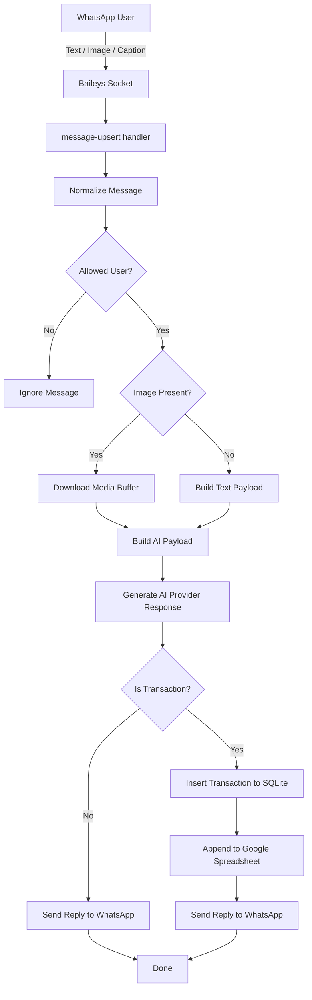

# Renqu Bot

Bot pencatatan keuangan berbasis WhatsApp dengan AI inference multi-provider untuk mengklasifikasikan transaksi pemasukan dan pengeluaran, menyimpan data ke SQLite, dan menyinkronkannya ke Google Spreadsheet.

## Overview

**Renqu Bot** membantu mencatat transaksi keuangan langsung dari percakapan WhatsApp. Pengguna dapat mengirim teks, gambar struk, atau gambar dengan caption, lalu sistem akan memproses input tersebut menggunakan AI untuk mengekstrak transaksi dan menyimpannya sebagai data keuangan terstruktur.

Saat ini aplikasi memiliki tiga bagian utama:

- **Bot runtime legacy** berbasis Bun + TypeScript di `src/`
- **Backend API admin** berbasis Bun di `services/api/`
- **Frontend admin GUI** berbasis Next.js di `apps/web/`

Dokumen arsitektur utama tersedia di `docs/specs.md` dan tasklist pengembangan ada di `docs/task.md`.

## Core Capabilities

- Menerima pesan WhatsApp dari user
- Mendukung input teks, gambar, dan gambar + caption
- Mengklasifikasikan transaksi sebagai pemasukan atau pengeluaran
- Menyimpan raw message dan transaksi ke SQLite
- Mengirim balasan otomatis ke WhatsApp
- Menyinkronkan transaksi ke Google Spreadsheet
- Membatasi akses berdasarkan daftar `ALLOWED_USER_IDS`
- Menyimpan sesi autentikasi WhatsApp ke database

## Current Architecture

Komponen utama saat ini:

- **Runtime**: Bun
- **Language**: TypeScript
- **Messaging**: Baileys
- **AI Inference**: saat ini Gemini, diarahkan ke arsitektur multi-provider
- **Database**: SQLite via `Bun.SQL`
- **Spreadsheet Integration**: Google Sheets API

Arah pengembangan saat ini:

- provider AI yang bisa dipilih: Gemini, OpenAI, Anthropic, dan custom OpenAI-compatible
- admin panel Next.js untuk setup konfigurasi dan monitoring
- health diagnostics dan status WhatsApp via GUI/API
- abstraction layer untuk AI, config, dan diagnostics service

## Project Structure

```text
renqubot/
├─ apps/
│  └─ web/                  # Next.js admin frontend
├─ docs/
│  ├─ specs.md
│  └─ task.md
├─ scripts/
├─ services/
│  └─ api/                  # Bun backend API untuk admin GUI
├─ src/
│  ├─ ai/
│  ├─ events/
│  ├─ spreadsheet/
│  ├─ whatsapp/
│  ├─ config.ts
│  ├─ db.ts
│  └─ index.ts
├─ .env.example
├─ bun.lock
├─ ecosystem.config.cjs
├─ package.json
├─ README.md
└─ tsconfig.json
```

## Application Flow



## Requirements

Sebelum menjalankan aplikasi, siapkan:

- [Bun](https://bun.sh)
- akun WhatsApp untuk login bot jika ingin menjalankan bot runtime
- API key provider AI jika ingin menjalankan bot runtime atau membuat readiness `ready`
- Google Spreadsheet ID dan Google Cloud service account key jika ingin menguji integrasi spreadsheet

## Configuration

Untuk sekadar mencoba admin backend dan frontend, `.env` belum wajib. Backend API tetap bisa berjalan dan akan menampilkan status `not_ready` sampai konfigurasi dilengkapi.

Untuk menjalankan bot WhatsApp legacy, salin `.env.example` menjadi `.env` lalu isi minimal `GEMINI_API_KEY`.

### Environment Variables

| Variable           | Required                     | Description                                               |
| ------------------ | ---------------------------- | --------------------------------------------------------- |
| `DATABASE_URL`     | No                           | Lokasi SQLite database. Default: `file:./data/baileys.db` |
| `GEMINI_API_KEY`   | Yes (current implementation) | API key Google Gemini                                     |
| `GEMINI_MODEL`     | No                           | Model Gemini yang digunakan                               |
| `GEMINI_HOST`      | No                           | Base URL Gemini custom                                    |
| `SPREADSHEET_ID`   | No                           | ID file Google Spreadsheet                                |
| `SPREADSHEET_NAME` | No                           | Nama file / konteks spreadsheet                           |
| `SHEET_NAME`       | No                           | Nama tab/sheet di dalam spreadsheet                       |
| `GCLOUD_KEY_PATH`  | No                           | Path ke file service account Google Cloud                 |
| `ALLOWED_USER_IDS` | No                           | Daftar user ID WhatsApp yang diizinkan, dipisahkan koma   |

### Notes

- Bot runtime legacy masih membaca konfigurasi dari environment variable.
- Admin backend menyimpan konfigurasi GUI di `data/config` dan secret metadata secara terpisah.
- `SPREADSHEET_NAME` dan `SHEET_NAME` sengaja dibedakan karena konteksnya berbeda.

## Getting Started

### 1. Install dependencies

```bash
bun install
```

### 2. Setup environment untuk bot runtime legacy

```bash
cp .env.example .env
```

Lalu isi konfigurasi yang dibutuhkan. Langkah ini bisa dilewati jika hanya ingin mencoba admin backend dan frontend.

### 3. Jalankan Backend API Admin

Buka terminal pertama:

```bash
bun run dev:backend
```

Backend API berjalan di:

```text
http://localhost:3001
```

Endpoint yang bisa langsung dicoba:

```text
GET http://localhost:3001/health
GET http://localhost:3001/ready
GET http://localhost:3001/api/config
GET http://localhost:3001/api/diagnostics/database
GET http://localhost:3001/api/diagnostics/ai
GET http://localhost:3001/api/diagnostics/spreadsheet
GET http://localhost:3001/api/whatsapp/status
GET http://localhost:3001/api/whatsapp/qr
GET http://localhost:3001/api/transactions
GET http://localhost:3001/api/summary
```

Catatan: `/health`, `/ready`, atau diagnostics AI bisa mengembalikan HTTP `503` jika API key/config belum lengkap. Itu normal untuk kondisi awal.

### 4. Jalankan Frontend Admin

Buka terminal kedua:

```bash
bun run dev:frontend
```

Frontend berjalan di:

```text
http://localhost:3000
```

Halaman utama:

```text
http://localhost:3000/dashboard
http://localhost:3000/setup
http://localhost:3000/integrations
http://localhost:3000/whatsapp
http://localhost:3000/transactions
http://localhost:3000/system
```

Jika backend dijalankan pada URL lain, set environment frontend:

```bash
NEXT_PUBLIC_API_BASE_URL=http://localhost:3001 bun run dev:frontend
```

### 5. Jalankan Bot WhatsApp Legacy

Buka terminal ketiga setelah `.env` lengkap:

```bash
bun start
```

Atau:

```bash
bun run start
```

### 6. Scan WhatsApp QR

Saat bot runtime berjalan, QR code akan muncul di terminal. QR/status juga ditulis ke `data/runtime/whatsapp-status.json` agar dapat dibaca halaman `/whatsapp` di admin GUI.

## Local Testing Flow

Urutan yang disarankan untuk test cepat:

1. Jalankan `bun install`
2. Jalankan `bun run dev:backend`
3. Buka `http://localhost:3001/api/config`
4. Jalankan `bun run dev:frontend`
5. Buka `http://localhost:3000/dashboard`
6. Coba halaman `/setup`, `/integrations`, dan `/whatsapp`
7. Jika ingin test bot WhatsApp, lengkapi `.env`, jalankan `bun start`, lalu scan QR

## Available Commands

```bash
bun start
bun run start
bun run dev:backend
bun run dev:frontend
bun run start:backend
bun run typecheck
bun run typecheck:backend
bun run typecheck:frontend
bun run bundle
bun run format
```

## Development Notes

- `src/` masih menjadi bot runtime legacy.
- `services/api` adalah backend API admin yang berjalan terpisah dari bot runtime.
- `apps/web` adalah frontend Next.js dengan sidebar biru collapsible dan main area putih.
- Readiness awal bisa `not_ready` sampai config provider AI dan WhatsApp dilengkapi.

## Roadmap Summary

Prioritas pengembangan berikutnya:

1. Tambahkan autentikasi admin untuk GUI dan endpoint sensitif
2. Hubungkan form frontend dengan seluruh endpoint config/secret/upload
3. Tingkatkan abstraction layer AI multi-provider
4. Tambahkan observability dan testing yang lebih lengkap
5. Siapkan deployment blueprint untuk frontend, backend API, dan bot runtime

Detail task tersedia di `docs/task.md`.

## Code Quality

Format kode:

```bash
bun run format
```

Type check:

```bash
bun run typecheck
bun run typecheck:backend
bun run typecheck:frontend
```

Build frontend:

```bash
bun --cwd apps/web run build
```

## Security Considerations

- Jangan commit file `.env`
- Jangan commit service account key Google Cloud
- Jangan log secret ke console
- Batasi `ALLOWED_USER_IDS` bila bot tidak boleh diakses publik
- Gunakan kredensial AI dan Google yang terpisah untuk environment development dan production

## Contributing

Untuk perubahan besar, mulai dari `docs/specs.md` agar arsitektur dan arah implementasi tetap konsisten.

Checklist kontribusi yang disarankan:

1. pahami konteks di `docs/specs.md`
2. cek prioritas di `docs/task.md`
3. ikuti struktur folder dan code style yang ada
4. jalankan formatting dan typecheck sebelum commit

## License

MIT
