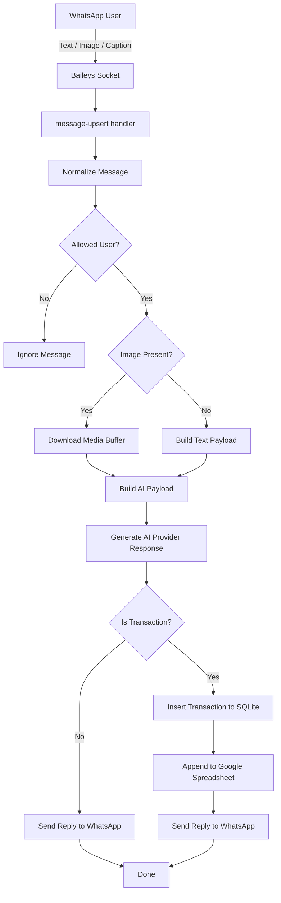
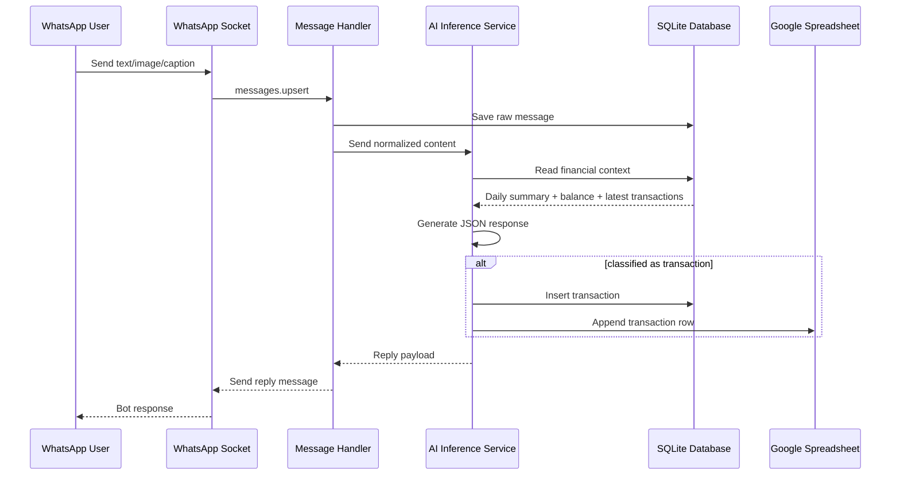

# Architecture Guidelines

## Project Overview

**Renqu Bot** adalah aplikasi bot pencatatan keuangan berbasis WhatsApp yang menerima input berupa teks, gambar, atau kombinasi keduanya, lalu menggunakan AI inference provider-agnostic untuk mengklasifikasikan apakah pesan tersebut merupakan transaksi pemasukan atau pengeluaran. Hasil klasifikasi kemudian disimpan ke database SQLite dan dapat disinkronkan ke Google Spreadsheet.

Arsitektur yang sudah berjalan saat ini adalah **backend monolith berbasis Bun + TypeScript** dengan integrasi utama berikut:

- **WhatsApp channel** menggunakan Baileys
- **AI inference** saat ini menggunakan Google Gemini, dengan target arsitektur multi-provider
- **Database lokal** menggunakan SQLite via `Bun.SQL`
- **Spreadsheet sink** menggunakan Google Sheets API
- **Konfigurasi** berbasis environment variable (`Bun.env`)

Target pengembangan berikutnya adalah menambahkan **GUI setup dan admin panel berbasis Next.js** untuk mengelola konfigurasi aplikasi seperti provider AI aktif, API key per provider, model, base URL custom OpenAI-compatible, Spreadsheet ID, nama file spreadsheet, nama sheet, allowed user IDs, credential Google Cloud, dan status sesi WhatsApp.

Spesifikasi ini dibuat agar agentic AI code generator memahami kondisi aplikasi saat ini, batasan teknis yang ada, serta arah arsitektur yang dituju.

## Feature Apps

### Existing Features

1. Menerima pesan WhatsApp dari user
2. Mendukung input:
   - teks
   - gambar
   - gambar + caption
3. Menyimpan pesan mentah ke database
4. Melakukan klasifikasi transaksi dengan AI provider yang dapat dipilih (Gemini, OpenAI, Anthropic, atau provider custom kompatibel OpenAI)
5. Menyimpan hasil transaksi ke SQLite
6. Mengirim balasan otomatis ke WhatsApp
7. Menyimpan transaksi ke Google Spreadsheet jika konfigurasi tersedia
8. Menyimpan sesi login WhatsApp ke database
9. Membatasi akses user berdasarkan `ALLOWED_USER_IDS`

### Planned Features

1. GUI setup berbasis Next.js
2. Admin panel untuk konfigurasi aplikasi
3. Endpoint health dan diagnostics
4. Tampilan QR WhatsApp melalui UI
5. Status koneksi WhatsApp melalui UI
6. Test koneksi provider AI, database, dan spreadsheet
7. Dashboard ringkas transaksi dan health sistem
8. Secure config management dan audit trail
9. Setup wizard multi-step
10. Operational admin console
11. Dukungan multi-provider AI inference
12. Pemilihan model per provider dan custom base URL untuk provider OpenAI-compatible

## Tech Stack

### Current Stack

- **Runtime**: Bun
- **Language**: TypeScript
- **Messaging**: Baileys
- **AI Model Provider**: Provider-agnostic inference layer (Gemini, OpenAI, Anthropic, custom OpenAI-compatible)
- **Database**: SQLite via `Bun.SQL`
- **Spreadsheet Integration**: Google Sheets API via `googleapis`
- **Formatting**: Prettier

### Target Additional Stack

- **Frontend Admin GUI**: Next.js
- **Frontend Language**: TypeScript
- **Frontend Rendering**: App Router recommended
- **State/Data Fetching**: fetch server/client sesuai kebutuhan
- **UI Layer**: reusable form components dan status components
- **AI SDK Layer**: adapter/provider abstraction untuk Gemini, OpenAI, Anthropic, dan OpenAI-compatible provider

## Folder & File Project Structure

### Current Structure

```text
renqubot/
├─ docs/
│  ├─ specs.md
│  └─ task.md
├─ scripts/
├─ src/
│  ├─ ai/
│  │  ├─ ai.ts
│  │  ├─ index.ts
│  │  └─ promt.ts
│  ├─ events/
│  │  ├─ group-upsert.ts
│  │  ├─ index.ts
│  │  └─ message-upsert.ts
│  ├─ spreadsheet/
│  │  ├─ index.ts
│  │  └─ sheet.ts
│  ├─ whatsapp/
│  │  ├─ index.ts
│  │  ├─ socket.ts
│  │  └─ storage.ts
│  ├─ config.ts
│  ├─ db.ts
│  └─ index.ts
├─ .env.example
├─ .gitignore
├─ LICENSE
├─ bun.lock
├─ ecosystem.config.cjs
├─ package.json
├─ README.md
└─ tsconfig.json
```

### Responsibility by Module

- `src/index.ts`
  - entrypoint aplikasi
  - bootstrap database
  - start WhatsApp socket

- `src/config.ts`
  - membaca environment variable
  - menyimpan nilai konfigurasi global
  - saat ini memiliki side-effect validasi saat import

- `src/db.ts`
  - inisialisasi koneksi SQLite
  - migrasi schema dasar
  - query helper transaksi dan ringkasan keuangan

- `src/ai/ai.ts`
  - integrasi AI inference
  - membangun context tambahan dari database
  - parsing hasil model
  - insert transaksi ke database
  - trigger sink ke spreadsheet

- `src/events/message-upsert.ts`
  - menerima event pesan dari WhatsApp
  - normalisasi payload pesan
  - filtering allowed user
  - download gambar bila ada
  - memanggil AI response generator
  - mengirim reply ke WhatsApp

- `src/whatsapp/socket.ts`
  - membangun socket Baileys
  - mengelola session auth
  - menangani reconnect/logout/QR
  - dispatch event messages dan groups

- `src/whatsapp/storage.ts`
  - menyimpan auth credentials WhatsApp ke SQLite

- `src/spreadsheet/sheet.ts`
  - append transaksi ke Google Spreadsheet

### Target Structure Recommendation

```text
renqubot/
├─ apps/
│  └─ web/                    # Next.js admin GUI (frontend terpisah)
│     ├─ src/app/             # App Router pages: dashboard, setup, integrations, whatsapp, transactions, system
│     ├─ src/components/layout/# AppShell, sidebar, topbar
│     ├─ src/components/ui/    # PageHeader, SectionCard, FormField, SecretInput, StatusBadge, WizardStepper
│     └─ src/components/*/     # Komponen presentational per domain admin
├─ docs/
├─ scripts/
├─ services/
│  └─ api/                    # Bun REST API backend terpisah
│     ├─ src/contracts/       # kontrak response, config, system status
│     ├─ src/lib/             # helper HTTP/API envelope
│     ├─ src/modules/ai/      # AI diagnostics/service boundary awal
│     ├─ src/modules/config/  # ConfigService dan penyimpanan config parsial
│     ├─ src/modules/database/# Database diagnostics dan SQLite helper
│     ├─ src/modules/health/  # HealthService agregasi komponen
│     ├─ src/modules/spreadsheet/ # Spreadsheet diagnostics/service boundary awal
│     └─ src/modules/system/  # SystemService status awal
├─ src/
│  ├─ ai/
│  ├─ api/                    # future HTTP API layer / legacy transition
│  ├─ config/
│  ├─ db/
│  ├─ domain/
│  ├─ events/
│  ├─ services/
│  ├─ spreadsheet/
│  ├─ whatsapp/
│  └─ index.ts                # legacy bot runtime entry
```

## Implementation Recommendation Status

Rekomendasi implementasi Phase 10 saat ini dipetakan sebagai berikut:

1. Backend configuration platform diprioritaskan lebih dulu melalui `ConfigService` di `services/api/src/modules/config`.
2. Next.js admin console berjalan terpisah di `apps/web` dengan backend API Bun di `services/api`.
3. Inti backend baru menggunakan `ConfigService`, `WhatsappService`, `DiagnosticsService`, `AiService`, `HealthService`, dan `DatabaseService`.
4. AI layer backend API memiliki adapter registry untuk Gemini, OpenAI, Anthropic, dan OpenAI-compatible provider di `services/api/src/modules/ai`.
5. MVP GUI dimulai dari Dashboard, Setup, Integrations, WhatsApp, Transactions, dan System.
6. Fase pertama delivery sudah mencakup save config draft, diagnostics provider AI, dan QR/status WhatsApp.
7. SQLite tetap digunakan dengan abstraction awal melalui `DatabaseService` dan schema queue Spreadsheet.
8. Integrasi Google Sheets sekarang memiliki fondasi `spreadsheet_sync_jobs` agar kegagalan sinkronisasi tidak harus memblokir transaksi utama.
9. Milestone delivery bertahap dicatat di `docs/release-plan.md`.

## Workflow (make with mermaid diagram syntax)



## Data Interaction (make with mermaid diagram syntax)



## Commands

### Existing Commands

```bash
bun start
bun run start
bun run typecheck
bun run bundle
bun run format
```

### Notes

- `bun start` atau `bun run start` menjalankan app utama legacy dari `src/index.ts`
- `bun run start:backend` menjalankan Bun backend service baru dari `services/api/src/index.ts`
- `bun run dev:frontend` menjalankan Next.js frontend dari `apps/web`
- `bun run dev:backend` menjalankan backend service Bun dalam mode watch
- `bun run typecheck` memerlukan `typescript` / `tsc` tersedia di environment
- `bun run typecheck:frontend` menjalankan typecheck khusus frontend Next.js
- `bun run typecheck:backend` menjalankan typecheck khusus backend Bun service
- `bun run format` menjalankan Prettier ke seluruh project
- Saat ini belum ada script lint backend dan test terpisah

## Backend API Contract

Backend service baru berada di `services/api` dan berjalan di port `API_PORT` atau default `3001`. Seluruh response API menggunakan envelope konsisten:

```json
{
  "success": true,
  "data": {},
  "error": null
}
```

Endpoint backend yang tersedia:

1. `GET /health`
   - status proses backend service.
2. `GET /ready`
   - readiness dasar service dan phase aktif.
3. `GET /api/system/status`
   - status sistem awal untuk dashboard admin.
4. `GET /api/config`
   - membaca konfigurasi tersimpan, status validasi, field yang belum lengkap, dan metadata secret yang sudah dimasking.
5. `POST /api/config` dan `PATCH /api/config`
   - menyimpan konfigurasi non-secret secara parsial untuk setup wizard.
6. `PATCH /api/config/secrets`
   - menyimpan secret provider AI dan hanya mengembalikan metadata masked value.
7. `POST /api/config/google-service-account`
   - menerima content JSON service account, menyimpan ke direktori terkontrol, lalu memperbarui `spreadsheet.serviceAccountPath`.
8. `GET /api/diagnostics/ai`
   - menjalankan diagnostics konfigurasi provider AI aktif, model, dan metadata secret.
9. `GET /api/diagnostics/spreadsheet`
   - menjalankan diagnostics konfigurasi Spreadsheet dan file service account.
10. `GET /api/diagnostics/database`
    - menjalankan diagnostics koneksi SQLite dan writable data directory.
11. `GET /api/whatsapp/status`
    - membaca connection state, error terakhir, dan metadata QR WhatsApp dari runtime state file.
12. `GET /api/whatsapp/qr`
    - membaca QR WhatsApp terakhir dengan TTL singkat.
13. `POST /api/whatsapp/reset-session`
    - menghapus session WhatsApp dari database jika payload menyertakan `confirm=RESET_WHATSAPP_SESSION`.
14. `GET /api/transactions?limit=25`
    - membaca transaksi terbaru untuk dashboard awal.
15. `GET /api/summary`
    - membaca saldo, pemasukan, pengeluaran, jumlah transaksi, dan transaksi terbaru.
16. `GET /api/ai/capabilities`
    - membaca capability registry provider AI.
17. `GET /api/spreadsheet-sync/jobs`
    - membaca daftar job sinkronisasi Spreadsheet.
18. `POST /api/spreadsheet-sync/retry`
    - menjalankan retry untuk job Spreadsheet berstatus `pending`.
19. `GET /api/bot-runtime/status`
    - membaca status proses bot runtime yang dinyalakan dari backend API.
20. `POST /api/bot-runtime/start`
    - menyalakan bot runtime legacy dari konfigurasi wizard. Untuk saat ini runtime start mendukung provider aktif Gemini.

Endpoint `/health` dan `/ready` sekarang menggunakan `HealthService` untuk mengagregasi status database, AI, spreadsheet, dan WhatsApp. Jika komponen critical tidak siap, endpoint dapat mengembalikan HTTP `503` dengan envelope error-free tetapi status readiness `not_ready`.

## Runtime Status Bridge

WhatsApp runtime legacy menulis status koneksi dan QR terakhir ke `data/runtime/whatsapp-status.json` melalui `src/whatsapp/runtime-state.ts`. Backend API membaca file ini untuk endpoint WhatsApp status dan QR. Pendekatan ini dipilih karena bot runtime dan backend API berjalan sebagai service terpisah, sehingga state tidak bisa hanya disimpan dalam memory process yang sama.

## Observability & Reliability

Phase 6 menambahkan fondasi reliability berikut:

1. Structured logging JSON untuk backend API dan bot runtime legacy dengan sanitasi field sensitif seperti `key`, `secret`, `token`, `password`, dan `credential`.
2. Correlation ID request API melalui header `x-correlation-id` atau `crypto.randomUUID()` bila header tidak tersedia.
3. Retry policy eksplisit untuk call Gemini dan append Google Sheets.
4. Health aggregation membedakan `healthy`, `degraded`, dan `unhealthy` melalui `HealthService`.
5. Fallback mode Google Sheets: transaksi tetap disimpan ke SQLite, sementara kegagalan append membuat job `spreadsheet_sync_jobs` berstatus `pending`.
6. Tabel transaksi memiliki `spreadsheet_sync_status` untuk menandai status sinkronisasi per transaksi.
7. Backend API menyediakan endpoint operasional:
   - `GET /api/spreadsheet-sync/jobs`
   - `POST /api/spreadsheet-sync/retry`

## Data & AI Quality

Phase 7 dan Phase 8 menambahkan guard domain berikut pada runtime bot legacy dan backend API:

1. Tabel `transactions` memiliki metadata `source_message_id`, `sender`, `raw_ai_result`, `confidence`, dan `processed_at`.
2. `source_message_id` diberi unique index agar pesan WhatsApp yang sama tidak menghasilkan transaksi ganda.
3. Tanggal transaksi dinormalisasi ke format `YYYY-MM-DD` sebelum disimpan dan sebelum disinkronkan ke Spreadsheet.
4. Output JSON AI divalidasi sebelum diproses; field wajib transaksi adalah `type`, `amount`, dan response utama `is_transaction` + `reply_text`.
5. Response AI invalid atau JSON rusak tidak disimpan sebagai transaksi dan dikembalikan sebagai fallback reply aman.
6. Confidence score disimpan sebagai angka `0..1`; jika model tidak mengirim confidence, runtime memakai default konservatif.
7. Payload gambar dibatasi ke MIME `image/jpeg`, `image/png`, atau `image/webp` dengan ukuran maksimum 20 MB sebelum diproses model.
8. Sinkronisasi Google Spreadsheet menulis header baris pertama `Timestamp`, `Jenis`, `Kategori`, `Jumlah`, `Merchant/Sumber`, dan `Keterangan`, lalu append transaksi pada kolom `A:F`.

## Configuration Platform

Config platform Phase 2 menggunakan strategi hybrid awal:

1. Legacy runtime bot masih dapat membaca environment variable melalui `src/config.ts`.
2. Backend admin service menyimpan konfigurasi parsial di `data/config/app-config.json`.
3. Secret provider AI disimpan terpisah di `data/config/app-secrets.json`, sedangkan response GUI hanya memakai `data/config/app-secrets-meta.json`.
4. Audit perubahan konfigurasi ditulis ke `data/config/audit-log.jsonl`.
5. Service account Google Cloud disimpan di `data/credentials/` dan path-nya disimpan sebagai konfigurasi spreadsheet.
6. Direktori `data/config` dan `data/credentials` diabaikan Git karena berisi konfigurasi lokal dan secret.

Schema database legacy juga sudah disiapkan untuk evolusi Config Platform:

1. `schema_migrations`
2. `app_config`
3. `app_secrets_meta`
4. `app_audit_logs`

## Code Style

### Components

- Saat ini project belum memiliki React/Next.js components
- Untuk pengembangan Next.js nanti, gunakan komponen kecil, reusable, dan berbasis domain
- Pisahkan container/data-fetching logic dari presentational component
- Form setup sebaiknya dibagi menjadi komponen seperti:
  - `ConfigSection`
  - `SecretInput`
  - `StatusBadge`
  - `ConnectionTestCard`
  - `WizardStep`

### Imports

- Gunakan import yang eksplisit dan konsisten
- Kelompokkan import berdasarkan urutan berikut:
  1. built-in / platform modules
  2. third-party dependencies
  3. internal modules
  4. types
- Hindari import yang tidak dipakai
- Pertahankan pola import yang sudah digunakan di file sekitar

### Naming Conventions

- File TypeScript util/service gunakan `kebab-case` atau struktur folder yang sudah ada
- Interface diawali `I` untuk mengikuti pola existing code, misalnya `IAIResponse`, `ITransaction`
- Function gunakan `camelCase`
- Constant global gunakan `UPPER_SNAKE_CASE`
- Nama folder domain gunakan noun yang jelas, misalnya `whatsapp`, `spreadsheet`, `events`, `services`
- Untuk Next.js nanti:
  - komponen React gunakan `PascalCase`
  - hooks gunakan `useXxx`
  - route segment gunakan nama yang deskriptif dan konsisten

### Error Handling

- Gunakan early return untuk validasi sederhana
- Logging error harus menyertakan konteks modul, misalnya `[AI]`, `[Whatsapp]`, `[Storage]`
- Jangan bocorkan secret ke log
- Untuk integrasi eksternal, tangkap error dan kembalikan hasil yang aman
- Untuk pengembangan berikutnya, standardisasi error perlu dibuat agar cocok untuk API dan GUI
- Untuk endpoint future API, gunakan format error response yang konsisten

## UI Components

Bagian ini adalah acuan untuk frontend Next.js yang akan dibangun.

### Frontend Theme Direction

Admin GUI Phase 4 menggunakan visual korporat dengan palet utama biru dan area kerja putih:

1. Sidebar memakai gradasi biru korporat (`#09245f`, `#123d8f`, `#1f6fd1`) dan dapat di-collapse.
2. Main content memakai background putih dengan surface abu muda `#f8fafc` untuk menjaga keterbacaan dashboard.
3. Status success, warning, dan danger menggunakan warna yang tetap bisa dibaca tanpa hanya mengandalkan warna karena label teks selalu tersedia.
4. Layout memakai App Router Next.js dengan route awal:
   - `/dashboard`
   - `/setup`
   - `/integrations`
   - `/whatsapp`
   - `/transactions`
   - `/system`
5. Komponen frontend dipisahkan antara layout, UI primitives, dan presentational components per domain agar fetcher/server integration dapat ditambahkan tanpa mengubah visual layer besar-besaran.
6. Halaman `/setup` menggunakan pola wizard linear dengan progress indicator, tombol Back/Next, validasi per step, auto-save draft konfigurasi non-secret, review page, dan tombol `Simpan & Nyalakan Bot` untuk menjalankan runtime setelah setup selesai.

### Recommended Core UI Components

1. `AppShell`
2. `SidebarNav`
3. `Topbar`
4. `PageHeader`
5. `SectionCard`
6. `ConfigForm`
7. `SecretField`
8. `FileUploadField`
9. `TagsInput`
10. `StatusBadge`
11. `HealthIndicator`
12. `QRCodePanel`
13. `WizardStepper`
14. `ConfirmDialog`
15. `EmptyState`
16. `ErrorState`
17. `LoadingState`
18. `SummaryStatCard`

### Initial UI Pages Recommendation

1. `/setup`
   - wizard konfigurasi awal
2. `/integrations`
   - AI provider, Spreadsheet, Database diagnostics
3. `/whatsapp`
   - status koneksi, QR code, reset session
4. `/dashboard`
   - saldo, jumlah transaksi, health ringkas
5. `/system`
   - config review, environment summary, audit log ke depan

## Accessibility

- Semua field form harus memiliki label yang jelas
- Gunakan input type yang sesuai (`password`, `text`, `file`)
- Error message harus terhubung ke field terkait
- Status koneksi harus bisa dibaca tanpa hanya mengandalkan warna
- Tombol aksi penting seperti reset session harus punya teks eksplisit
- Fokus keyboard harus jelas dan tidak hilang saat dialog/popup dibuka
- QR code panel harus menyertakan deskripsi teks status, bukan hanya gambar/visual
- Gunakan semantic HTML pada frontend Next.js nanti
- Pastikan kontras warna memadai pada status success, warning, error
- Loading dan background process perlu indikator yang bisa dipahami screen reader

## Additional Architectural Notes

1. Arsitektur saat ini masih **monolith** dan **env-driven**
2. `src/config.ts` masih memiliki side-effect saat import dan perlu direfactor sebelum GUI setup dibangun
3. Saat ini belum ada HTTP API internal untuk konsumsi Next.js
4. WhatsApp QR masih hanya dicetak ke terminal, belum diekspos ke UI
5. Penyimpanan config dan secret belum siap untuk workflow admin GUI
6. Diagram dan guideline ini harus dijadikan baseline sebelum implementasi Next.js dimulai
7. Untuk konteks spreadsheet:
   - `SPREADSHEET_NAME` diperlakukan sebagai nama file / konteks konfigurasi spreadsheet
   - `SHEET_NAME` diperlakukan sebagai nama sheet/tab di dalam file spreadsheet
   - Keduanya dibiarkan berbeda karena memang beda konteks bisnis
