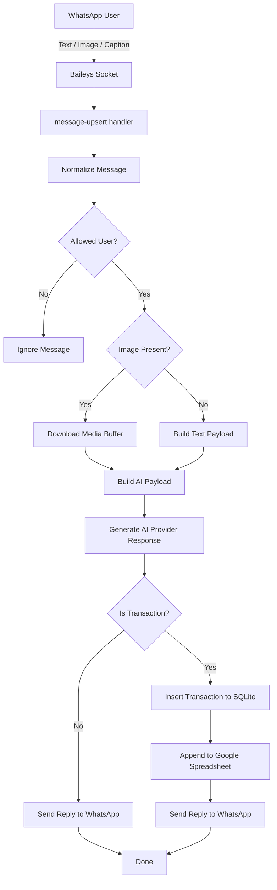
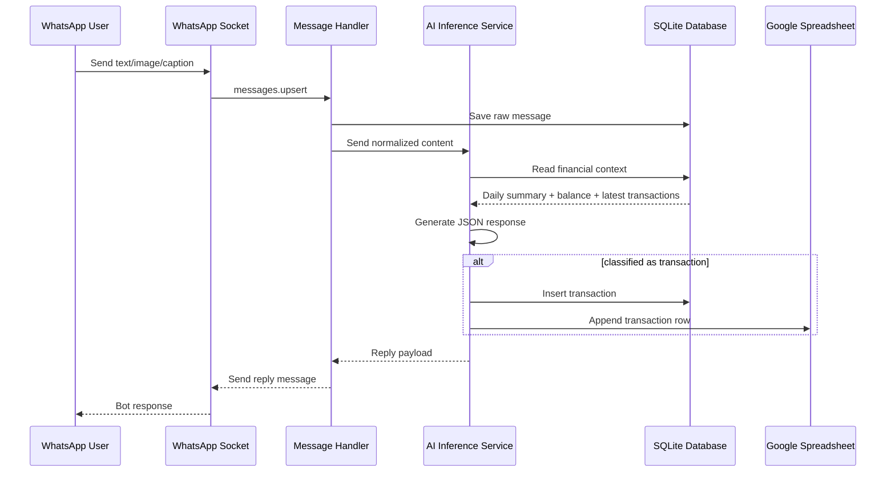

# Architecture Guidelines

## Project Overview

**Renqu Bot** adalah aplikasi bot pencatatan keuangan berbasis WhatsApp yang menerima input berupa teks, gambar, atau kombinasi keduanya, lalu menggunakan AI inference provider-agnostic untuk mengklasifikasikan apakah pesan tersebut merupakan transaksi pemasukan atau pengeluaran. Hasil klasifikasi kemudian disimpan ke database SQLite dan dapat disinkronkan ke Google Spreadsheet.

Arsitektur yang sudah berjalan saat ini adalah **backend monolith berbasis Bun + TypeScript** dengan integrasi utama berikut:

- **WhatsApp channel** menggunakan Baileys
- **AI inference** saat ini menggunakan Google Gemini, dengan target arsitektur multi-provider
- **Database lokal** menggunakan SQLite via `Bun.SQL`
- **Spreadsheet sink** menggunakan Google Sheets API
- **Konfigurasi** berbasis environment variable (`Bun.env`)

Target pengembangan berikutnya adalah menambahkan **GUI setup dan admin panel berbasis Next.js** untuk mengelola konfigurasi aplikasi seperti provider AI aktif, API key per provider, model, base URL custom OpenAI-compatible, Spreadsheet ID, nama file spreadsheet, nama sheet, allowed user IDs, credential Google Cloud, dan status sesi WhatsApp.

Spesifikasi ini dibuat agar agentic AI code generator memahami kondisi aplikasi saat ini, batasan teknis yang ada, serta arah arsitektur yang dituju.

## Feature Apps

### Existing Features

1. Menerima pesan WhatsApp dari user
2. Mendukung input:
   - teks
   - gambar
   - gambar + caption
3. Menyimpan pesan mentah ke database
4. Melakukan klasifikasi transaksi dengan AI provider yang dapat dipilih (Gemini, OpenAI, Anthropic, atau provider custom kompatibel OpenAI)
5. Menyimpan hasil transaksi ke SQLite
6. Mengirim balasan otomatis ke WhatsApp
7. Menyimpan transaksi ke Google Spreadsheet jika konfigurasi tersedia
8. Menyimpan sesi login WhatsApp ke database
9. Membatasi akses user berdasarkan `ALLOWED_USER_IDS`

### Planned Features

1. GUI setup berbasis Next.js
2. Admin panel untuk konfigurasi aplikasi
3. Endpoint health dan diagnostics
4. Tampilan QR WhatsApp melalui UI
5. Status koneksi WhatsApp melalui UI
6. Test koneksi provider AI, database, dan spreadsheet
7. Dashboard ringkas transaksi dan health sistem
8. Secure config management dan audit trail
9. Setup wizard multi-step
10. Operational admin console
11. Dukungan multi-provider AI inference
12. Pemilihan model per provider dan custom base URL untuk provider OpenAI-compatible

## Tech Stack

### Current Stack

- **Runtime**: Bun
- **Language**: TypeScript
- **Messaging**: Baileys
- **AI Model Provider**: Provider-agnostic inference layer (Gemini, OpenAI, Anthropic, custom OpenAI-compatible)
- **Database**: SQLite via `Bun.SQL`
- **Spreadsheet Integration**: Google Sheets API via `googleapis`
- **Formatting**: Prettier

### Target Additional Stack

- **Frontend Admin GUI**: Next.js
- **Frontend Language**: TypeScript
- **Frontend Rendering**: App Router recommended
- **State/Data Fetching**: fetch server/client sesuai kebutuhan
- **UI Layer**: reusable form components dan status components
- **AI SDK Layer**: adapter/provider abstraction untuk Gemini, OpenAI, Anthropic, dan OpenAI-compatible provider

## Folder & File Project Structure

### Current Structure

```text
renqubot/
├─ docs/
│  ├─ specs.md
│  └─ task.md
├─ scripts/
├─ src/
│  ├─ ai/
│  │  ├─ ai.ts
│  │  ├─ index.ts
│  │  └─ promt.ts
│  ├─ events/
│  │  ├─ group-upsert.ts
│  │  ├─ index.ts
│  │  └─ message-upsert.ts
│  ├─ spreadsheet/
│  │  ├─ index.ts
│  │  └─ sheet.ts
│  ├─ whatsapp/
│  │  ├─ index.ts
│  │  ├─ socket.ts
│  │  └─ storage.ts
│  ├─ config.ts
│  ├─ db.ts
│  └─ index.ts
├─ .env.example
├─ .gitignore
├─ LICENSE
├─ bun.lock
├─ ecosystem.config.cjs
├─ package.json
├─ README.md
└─ tsconfig.json
```

### Responsibility by Module

- `src/index.ts`
  - entrypoint aplikasi
  - bootstrap database
  - start WhatsApp socket

- `src/config.ts`
  - membaca environment variable
  - menyimpan nilai konfigurasi global
  - saat ini memiliki side-effect validasi saat import

- `src/db.ts`
  - inisialisasi koneksi SQLite
  - migrasi schema dasar
  - query helper transaksi dan ringkasan keuangan

- `src/ai/ai.ts`
  - integrasi AI inference
  - membangun context tambahan dari database
  - parsing hasil model
  - insert transaksi ke database
  - trigger sink ke spreadsheet

- `src/events/message-upsert.ts`
  - menerima event pesan dari WhatsApp
  - normalisasi payload pesan
  - filtering allowed user
  - download gambar bila ada
  - memanggil AI response generator
  - mengirim reply ke WhatsApp

- `src/whatsapp/socket.ts`
  - membangun socket Baileys
  - mengelola session auth
  - menangani reconnect/logout/QR
  - dispatch event messages dan groups

- `src/whatsapp/storage.ts`
  - menyimpan auth credentials WhatsApp ke SQLite

- `src/spreadsheet/sheet.ts`
  - append transaksi ke Google Spreadsheet

### Target Structure Recommendation

```text
renqubot/
├─ apps/
│  └─ web/                    # Next.js admin GUI
├─ docs/
├─ scripts/
├─ src/
│  ├─ ai/
│  ├─ api/                    # future HTTP API layer
│  ├─ config/
│  ├─ db/
│  ├─ domain/
│  ├─ events/
│  ├─ services/
│  ├─ spreadsheet/
│  ├─ whatsapp/
│  └─ index.ts
```

## Workflow (make with mermaid diagram syntax)



## Data Interaction (make with mermaid diagram syntax)



## Commands

### Existing Commands

```bash
bun start
bun run start
bun run typecheck
bun run bundle
bun run format
```

### Notes

- `bun start` atau `bun run start` menjalankan app utama dari `src/index.ts`
- `bun run typecheck` memerlukan `typescript` / `tsc` tersedia di environment
- `bun run format` menjalankan Prettier ke seluruh project
- Saat ini belum ada script lint dan test terpisah

## Code Style

### Components

- Saat ini project belum memiliki React/Next.js components
- Untuk pengembangan Next.js nanti, gunakan komponen kecil, reusable, dan berbasis domain
- Pisahkan container/data-fetching logic dari presentational component
- Form setup sebaiknya dibagi menjadi komponen seperti:
  - `ConfigSection`
  - `SecretInput`
  - `StatusBadge`
  - `ConnectionTestCard`
  - `WizardStep`

### Imports

- Gunakan import yang eksplisit dan konsisten
- Kelompokkan import berdasarkan urutan berikut:
  1. built-in / platform modules
  2. third-party dependencies
  3. internal modules
  4. types
- Hindari import yang tidak dipakai
- Pertahankan pola import yang sudah digunakan di file sekitar

### Naming Conventions

- File TypeScript util/service gunakan `kebab-case` atau struktur folder yang sudah ada
- Interface diawali `I` untuk mengikuti pola existing code, misalnya `IAIResponse`, `ITransaction`
- Function gunakan `camelCase`
- Constant global gunakan `UPPER_SNAKE_CASE`
- Nama folder domain gunakan noun yang jelas, misalnya `whatsapp`, `spreadsheet`, `events`, `services`
- Untuk Next.js nanti:
  - komponen React gunakan `PascalCase`
  - hooks gunakan `useXxx`
  - route segment gunakan nama yang deskriptif dan konsisten

### Error Handling

- Gunakan early return untuk validasi sederhana
- Logging error harus menyertakan konteks modul, misalnya `[AI]`, `[Whatsapp]`, `[Storage]`
- Jangan bocorkan secret ke log
- Untuk integrasi eksternal, tangkap error dan kembalikan hasil yang aman
- Untuk pengembangan berikutnya, standardisasi error perlu dibuat agar cocok untuk API dan GUI
- Untuk endpoint future API, gunakan format error response yang konsisten

## UI Components

Bagian ini adalah acuan untuk frontend Next.js yang akan dibangun.

### Recommended Core UI Components

1. `AppShell`
2. `SidebarNav`
3. `Topbar`
4. `PageHeader`
5. `SectionCard`
6. `ConfigForm`
7. `SecretField`
8. `FileUploadField`
9. `TagsInput`
10. `StatusBadge`
11. `HealthIndicator`
12. `QRCodePanel`
13. `WizardStepper`
14. `ConfirmDialog`
15. `EmptyState`
16. `ErrorState`
17. `LoadingState`
18. `SummaryStatCard`

### Initial UI Pages Recommendation

1. `/setup`
   - wizard konfigurasi awal
2. `/integrations`
   - AI provider, Spreadsheet, Database diagnostics
3. `/whatsapp`
   - status koneksi, QR code, reset session
4. `/dashboard`
   - saldo, jumlah transaksi, health ringkas
5. `/system`
   - config review, environment summary, audit log ke depan

## Accessibility

- Semua field form harus memiliki label yang jelas
- Gunakan input type yang sesuai (`password`, `text`, `file`)
- Error message harus terhubung ke field terkait
- Status koneksi harus bisa dibaca tanpa hanya mengandalkan warna
- Tombol aksi penting seperti reset session harus punya teks eksplisit
- Fokus keyboard harus jelas dan tidak hilang saat dialog/popup dibuka
- QR code panel harus menyertakan deskripsi teks status, bukan hanya gambar/visual
- Gunakan semantic HTML pada frontend Next.js nanti
- Pastikan kontras warna memadai pada status success, warning, error
- Loading dan background process perlu indikator yang bisa dipahami screen reader

## Additional Architectural Notes

1. Arsitektur saat ini masih **monolith** dan **env-driven**
2. `src/config.ts` masih memiliki side-effect saat import dan perlu direfactor sebelum GUI setup dibangun
3. Saat ini belum ada HTTP API internal untuk konsumsi Next.js
4. WhatsApp QR masih hanya dicetak ke terminal, belum diekspos ke UI
5. Penyimpanan config dan secret belum siap untuk workflow admin GUI
6. Diagram dan guideline ini harus dijadikan baseline sebelum implementasi Next.js dimulai
7. Untuk konteks spreadsheet:
   - `SPREADSHEET_NAME` diperlakukan sebagai nama file / konteks konfigurasi spreadsheet
   - `SHEET_NAME` diperlakukan sebagai nama sheet/tab di dalam file spreadsheet
   - Keduanya dibiarkan berbeda karena memang beda konteks bisnis
